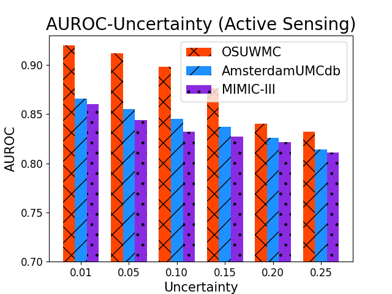

# SepsisLab: Early Sepsis Prediction with Uncertainty Quantification and Active Sensing

This repository contains the official PyTorch implementation of the following paper:

> **SepsisLab: Early Sepsis Prediction with Uncertainty Quantification and Active Sensing**<br>
> Changchang yin, Pin-Yu Chen, Bingsheng Yao, Dakuo Wang, Jeffrey Caterino, Ping Zhang<br>
> [paper]()
>
> **Abstract:** * Sepsis is the leading cause of in-hospital mortality in the USA. Early sepsis onset prediction and diagnosis could significantly improve the survival of sepsis patients. Existing predictive models are usually trained on high-quality data with few missing information, while missing values widely exist in real-world clinical scenarios (especially in the first hours of admissions to the hospital), which causes a significant decrease in accuracy and an increase in uncertainty for the predictive models. The common method to handle missing values is imputation, which replaces the unavailable variables with estimates from the observed data. The uncertainty of imputation results can be propagated to the sepsis prediction outputs, which have not been studied in existing works on either sepsis prediction or uncertainty quantification. In this study, we first define such propagated uncertainty as the variance of prediction output and then introduce uncertainty propagation methods to quantify the propagated uncertainty. Moreover, for the potential high-risk patients with low confidence due to limited observations, we propose a robust active sensing algorithm to increase confidence by actively recommending clinicians to observe the most informative variables.  We validate the proposed models in both publicly available data (i.e., MIMIC-III and AmsterdamUMCdb) and proprietary data in The Ohio State University Wexner Medical Center (OSUWMC). The experimental results show that the propagated uncertainty is dominant at the beginning of admissions to hospitals and the proposed algorithm outperforms state-of-the-art active sensing methods. Finally, we implement a SepsisLab system for early sepsis prediction and active sensing based on our pre-trained models. Clinicians and potential sepsis patients can benefit from the system in early prediction and diagnosis of sepsis.  *

# Framework 

SepsisLab imputes missing values, makes sepsis predictions, compute the uncertainty propagated uncertainty from missing values and use active sensing to improve sepsis prediction results. 


Model framework. (A) The imputation model takes observed variables and corresponding timestamps as input,
and generates the distribution of missing values. (B) Sepsis prediction model produces the patients’ sepsis onset risks with
uncertainty based on the imputed data. (C) shows the uncertainty quantification method with Monte-Carlo sampling. (D)
displays the uncertainty propagation method that can estimate propagated uncertainty by multiplying models’ gradient over
imputed variables and the imputation uncertainty.


Settings of sepsis onset prediction.


User Interface of Our SepsisLab System. (A) Patient
list with sepsis risk prediction score. (B) The patient’s de-
mographics and the dashboard of the patient’s historical
observations. (C) Predicted sepsis risk score with uncertainty
range and recommended lab test items to observe.


The Interactive Lab Test Recommendation Module in SepsisLab System.

# Files Directory
    SepsisLab
    |
    |--code
    |    |
    |    |--imputation                           * SepsisLab imputes the missing values and generate uncertainty of missing values
    |    |
    |    |--prediction                           * SepsisLab predicts sepsis risks and use active sensing to reduce propagated uncertainty
    |
    |--file                                 * The preprocessing codes will write some files here.
    |
    |--data                                 * Put the downloaded datasets here.
    |    |
    |    |--OSUWMC                           
    |    |    |
    |    |    |--train_groundtruth
    |    |    |
    |    |    |--sepsis_labels
    |    |
    |    |--MIMIC
    |    |    |
    |    |    |--train_groundtruth
    |    |    |
    |    |    |--sepsis_labels
    |    |    
    |    |--AmsterdamUMCdb
    |    |    |
    |    |    |--train_groundtruth
    |    |    |
    |    |    |--sepsis_labels
    | 
    | 
    |--result                             * The results of imputation, sepsis prediction and active sensing will be saved here.
    |    |--OSUWMC                           
    |    |
    |    |--MIMIC
    |    |    
    |    |--AmsterdamUMCdb

# Environment
Ubuntu16.04, python3.8


# Data preprocessing


## MIMIC-III data preprocessing
1. Download [MIMIC-III](https://mimic.physionet.org) dataset and put the data in TAME/data/MIMIC/initial\_mimiciii/.

2. Generate pivoted files (pivoted\_lab.csv, pivoted\_vital.csv, pivoted\_sofa.csv) according to [MIT-LCP/mimic-code](https://github.com/MIT-LCP/mimic-code/blob/master/concepts/pivot/), and put the data in TAME/data/MIMIC/initial\_mimiciii/.

-	SQL for pivoted file generation can be found [here](https://github.com/yinchangchang/TAME/blob/master/code/preprocessing/pivoted_file_generation.md).

3. Preprocess MIMIC-III data.
```
cd code/preprocessing
python preprocess_mimic_data.py --dataset MIMIC
python generate_sepsis_variables.py --dataset MIMIC
python generate_value_distribution.py --dataset MIMIC
```

# Imputation

1. Train imputation model.
```
cd code/imputation
python main.py --dataset MIMIC
```

2. Generate the imputation results.
```
cd code/imputation
python main.py --dataset MIMIC --phase test --resume ../../data/MIMIC/models/best.ckpt
```

## Results of imputation

The RMSE imputation results on MIMIC dataset.
```
-----------------------------------------------------------------------------------------------------------------------------------------------------------------------------------------------------------------------------------------------------------------------------------------------------------------------------------------------------------------------------------------
Model   |  aniongap  |bicarbonate | creatinine |  chloride  |  glucose   | hemoglobin |  lactate   |  platelet  |    ptt     |    inr     |     pt     |   sodium   |    bun     |    wbc     |    spo2    | C-reactive | heartrate  | hematocrit |   sysbp    |   tempc    |   diasbp   |     gcs    |  resprate  |   bands    |   meanbp   | Magnesium  |urineoutput |    Mean    
-----------------------------------------------------------------------------------------------------------------------------------------------------------------------------------------------------------------------------------------------------------------------------------------------------------------------------------------------------------------------------------------
Mean    |    0.29    |    0.24    |    0.25    |    0.22    |    0.30    |    0.27    |    0.42    |    0.27    |    0.46    |    0.32    |    0.41    |    0.24    |    0.23    |    0.26    |    0.32    |    1.37    |    0.40    |    0.31    |    0.31    |    0.38    |    0.32    |    0.37    |    0.31    |    0.86    |    0.22    |    0.42    |    0.34    |    0.37
KNN     |    0.28    |    0.22    |    0.22    |    0.22    |    0.30    |    0.25    |    0.44    |    0.26    |    0.38    |    0.31    |    0.29    |    0.24    |    0.22    |    0.25    |    0.30    |    1.31    |    0.37    |    0.28    |    0.24    |    0.37    |    0.24    |    0.38    |    0.27    |    0.80    |    0.17    |    0.41    |    0.33    |    0.34
3DMICe  |    0.22    |    0.19    |    0.22    |    0.18    |    0.27    |    0.18    |    0.42    |    0.25    |    0.40    |    0.25    |    0.29    |    0.20    |    0.22    |    0.25    |    0.27    |    1.20    |    0.34    |    0.28    |    0.24    |    0.36    |    0.20    |    0.33    |    0.27    |    0.79    |    0.15    |    0.38    |    0.30    |    0.32
-----------------------------------------------------------------------------------------------------------------------------------------------------------------------------------------------------------------------------------------------------------------------------------------------------------------------------------------------------------------------------------------
BRNN    |    0.15    |    0.17    |    0.20    |    0.13    |    0.29    |    0.12    |    0.40    |    0.20    |    0.41    |    0.16    |    0.24    |    0.18    |    0.17    |    0.26    |    0.25    |    1.28    |    0.31    |    0.25    |    0.18    |    0.26    |    0.17    |    0.23    |    0.24    |    0.96    |    0.13    |    0.36    |    0.27    |    0.30
CATSI   |    0.12    |    0.12    |    0.22    |    0.13    |    0.29    |    0.14    |    0.41    |    0.22    |    0.42    |    0.20    |    0.25    |    0.18    |    0.20    |    0.23    |    0.25    |    1.13    |    0.34    |    0.25    |    0.18    |    0.24    |    0.16    |    0.22    |    0.24    |    0.85    |    0.13    |    0.33    |    0.27    |    0.29
DETROIT |    0.11    |    0.09    |    0.28    |    0.09    |    0.27    |    0.13    |    0.38    |    0.22    |    0.46    |    0.17    |    0.24    |    0.10    |    0.17    |    0.22    |    0.26    |    1.10    |    0.31    |    0.26    |    0.18    |    0.24    |    0.16    |    0.23    |    0.24    |    0.78    |    0.13    |    0.33    |    0.25    |    0.27
BRITS   |    0.12    |    0.08    |    0.23    |    0.12    |    0.27    |    0.12    |    0.39    |    0.20    |    0.41    |    0.18    |    0.24    |    0.16    |    0.20    |    0.20    |    0.26    |    1.22    |    0.32    |    0.23    |    0.19    |    0.23    |    0.15    |    0.20    |    0.24    |    0.84    |    0.13    |    0.34    |    0.26    |    0.28
-----------------------------------------------------------------------------------------------------------------------------------------------------------------------------------------------------------------------------------------------------------------------------------------------------------------------------------------------------------------------------------------
TAME-T  |    0.13    |    0.11    |    0.24    |    0.10    |    0.25    |    0.11    |    0.34    |    0.19    |    0.36    |    0.21    |    0.24    |    0.11    |    0.17    |    0.20    |    0.24    |    1.29    |    0.24    |    0.17    |    0.15    |    0.25    |    0.13    |    0.16    |    0.23    |    0.71    |    0.12    |    0.30    |    0.24    |    0.26
TAME-V  |    0.16    |    0.13    |    0.23    |    0.12    |    0.26    |    0.11    |    0.36    |    0.20    |    0.38    |    0.19    |    0.22    |    0.14    |    0.17    |    0.20    |    0.23    |    1.29    |    0.23    |    0.18    |    0.13    |    0.21    |    0.12    |    0.15    |    0.22    |    0.70    |    0.11    |    0.31    |    0.24    |    0.26
TAME-M  |    0.13    |    0.11    |    0.24    |    0.10    |    0.25    |    0.11    |    0.34    |    0.19    |    0.36    |    0.21    |    0.24    |    0.11    |    0.17    |    0.23    |    0.24    |    1.33    |    0.24    |    0.20    |    0.14    |    0.25    |    0.14    |    0.16    |    0.24    |    0.73    |    0.14    |    0.32    |    0.25    |    0.27
TAME    |    0.11    |    0.09    |    0.19    |    0.08    |    0.26    |    0.09    |    0.35    |    0.18    |    0.38    |    0.15    |    0.20    |    0.10    |    0.14    |    0.21    |    0.22    |    1.16    |    0.23    |    0.19    |    0.13    |    0.24    |    0.12    |    0.16    |    0.20    |    0.73    |    0.12    |    0.31    |    0.23    |    0.25
-----------------------------------------------------------------------------------------------------------------------------------------------------------------------------------------------------------------------------------------------------------------------------------------------------------------------------------------------------------------------------------------
```


# Sepsis prediction

Compute sepsis prediction.
```
cd code/prediction
python main.py
```

# Active Sensing
Use active sensing to reduce propagated uncertainty.
```
cd code/prediction
python active_sensing.py
```


# Results
## Uncertainty over different active sensing ratio


## Sepsis onset prediction performance with different uncertainty



